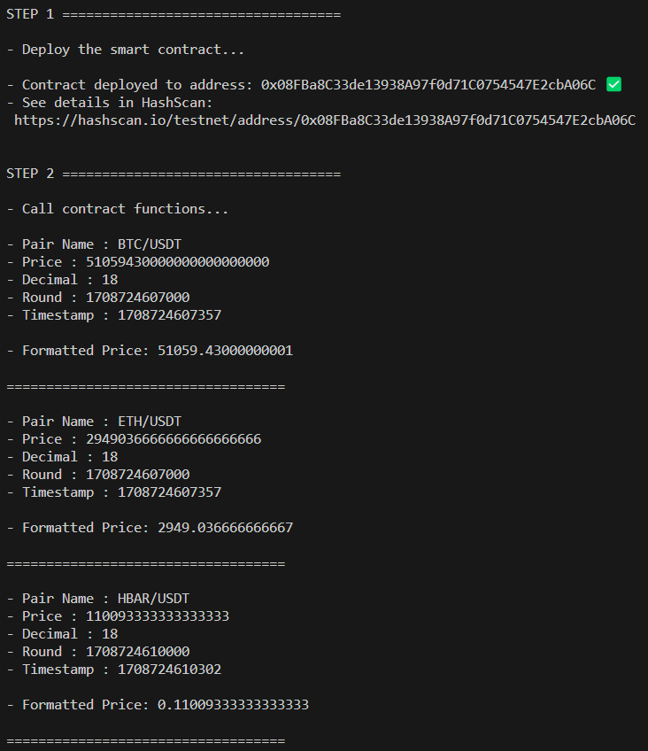

# Supra Demo on Hedera - Push

This example shows how to use Supra Oracles real-world data feeds (Push model).

## [`main.js`](./main.js)

With this script, you start by deploying the [`ConsumerContract.sol`](./contracts/ConsumerContract.sol) and passing to its contructor the Supra storage contract address (`storageContractAddress`). Get the right address from: [https://supra.com/docs/data-feeds/decentralized/networks/](https://supra.com/docs/data-feeds/decentralized/networks/)

Then call the `getPrice` and/or `getPriceForMultiplePair` functions using the desired price pair indices. Get the right price pair indices from: [https://supra.com/docs/data-feeds/data-feeds-index/](https://supra.com/docs/data-feeds/data-feeds-index/)

# Try this Example on Your Broswer with GitPod

1. Go to [this link](https://gitpod.io/#https://github.com/hedera-dev/hedera-example-supra-oracle-contract-push)

2. Run the following commands on the terminal:

   `npm install`

3. Rename the file `.env.SAMPLE` to `.env` and enter you Hedera network credentials (testnet/mainnet):

   `cp .env.SAMPLE .env`

4. Run the `main.js` script:

   `node main.js`

   
